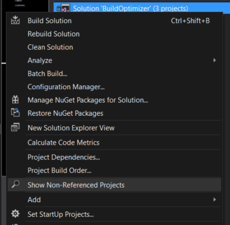

# VSBuildOptimizer

Download this extension from the [VS Gallery](https://visualstudiogallery.msdn.microsoft.com/dfda605b-4d2d-429d-b898-f20c8355c2b4).

---------------------------------------

Visual Studio extension for optimizing build speed by reducing unnecessary project\lib copying. 
Project also can show independent projects in your solution and check all lib reference on the same versions and .dll paths.

You should use optimized build just if 

See the [change log](CHANGELOG.md) for changes and road map.

## How does it works?

Extension use ProjectObjectModel.dll, written by myself (but lib code on a private working repository).
Using *.sln and *.csproj files creates a model of the project (references tree).
Model optimizes the project as follows:

- All inner references of the project are collected and adding to the top (that's why it's important to have the same libs with the same versions and *.dll paths, otherwise highest version will be chosen, but program will warn you about this)
- Then model creates itself copy on a disk, top project makes all self references _copylocal = true_, all subprojectses references _copylocal = false_ (same libs will be downloaded one time, at the top project's bin directory)
- Then solution's copy autobuild starts.
- After that, you can saw some build errors. It can happen because of the same names in different namespaces for example. In that case, yoy can open solution copy (it won't be deleted while cmd window is open) and fix all problems.
 

## Features

- Show independent projects in solution
- Check inner project references on same versions and .dll paths
- Optimize all references for selected project and build __all projects__ in solution

### Non-referenced Projects

If you have many projects in one solution, you can probably want to know, which projects are non-referenced (don't referenced by other projects in same solution)

Select solution in solution explorer and right-click.

Result will be at the output window (VSBuildOptimizer panel)

### Reference checking

You can check projects by one before building. (Or you can saw too many errors in window =) )
There probably will be many warnings with different versions of the same lib. That's because lib's version info in *.csproj file doesn't always actual and correct.

Select project in solution explorer and right-click.

Errors (if there are any) will be at the output window (VSBuildOptimizer panel)

### Optimized build

The work of this command is described in detail in "How does it works?" 

Select project in solution explorer and right-click.

Cmd window with msbuild utility will be launched.

## Contribute

Check out the [contribution guidelines](CONTRIBUTING.md)
if you want to contribute to this project.

For cloning and building this project yourself, make sure
to install the
[Extensibility Tools 2015](https://visualstudiogallery.msdn.microsoft.com/ab39a092-1343-46e2-b0f1-6a3f91155aa6)
extension for Visual Studio which enables some features
used by this project.

## License

[Apache 2.0](LICENSE)